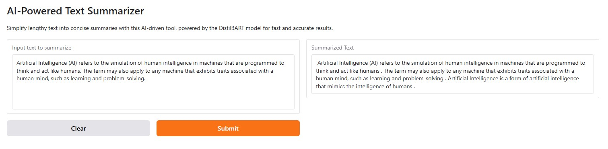

# AI-Powered Text Summarizer  

  

## Overview  
The AI-Powered Text Summarizer is a web-based application designed to simplify and condense lengthy text into concise and meaningful summaries. Built using the Gradio interface and Hugging Face's powerful `sshleifer/distilbart-cnn-12-6` model, this tool leverages state-of-the-art natural language processing (NLP) techniques for text summarization.  

## Features  
- **Interactive Web Interface:** Intuitive and user-friendly interface built with Gradio.  
- **Fast and Accurate Summarization:** Powered by Hugging Face's `DistilBART CNN` model for efficient text summarization.  
- **AI-Driven Technology:** Utilizes cutting-edge NLP methods for high-quality results.  
- **Seamless Deployment:** Easy to use and deploy locally or on the cloud.  

## Model Details  
This project uses the `sshleifer/distilbart-cnn-12-6` model from Hugging Face.  
- **Model:** DistilBART CNN  
- **Description:** DistilBART is a distilled version of the BART model optimized for efficiency. The CNN version is specifically fine-tuned for text summarization tasks, making it an excellent choice for this application.  
- **Hugging Face Model Link:** [DistilBART CNN-12-6](https://huggingface.co/sshleifer/distilbart-cnn-12-6)  

## Installation  

### Prerequisites  
Ensure you have Python installed along with `pip`. This project is compatible with Python 3.7 or higher.  

### Steps  
1. Clone the repository:  
   ```bash
   git clone https://github.com/ShubhamVankalas/AI-Powered-Text-Summarizer
   cd text-summarizer
   ```
   
2. Install the required dependencies:
 - transformers
 - torch
 - gradio

```bash
pip install -r requirements.txt
```

3. Run the application:

```bash
python app.py
```

## Usage
1. Open your web browser and navigate to the link provided after running the script (usually http://127.0.0.1:7860/).
2. Enter the text you want to summarize into the input box.
3. Click the "Submit" button to generate a concise summary.
4. The summarized text will appear in the output box below.

## Example Input and Output

Input:

```vbnet
Artificial Intelligence (AI) refers to the simulation of human intelligence in machines that are programmed to think and act like humans. The term may also apply to any machine that exhibits traits associated with a human mind, such as learning and problem-solving.
```

Output:
```vbnet
 Artificial Intelligence (AI) refers to the simulation of human intelligence in machines that are programmed to think and act like humans . The term may also apply to any machine that exhibits traits associated with a human mind, such as learning and problem-solving . Artificial Intelligence is a form of artificial intelligence that mimics the intelligence of humans . 
```

## Technologies Used
 - Python: Programming language.
 - Hugging Face Transformers: Provides pre-trained models for NLP tasks.
 - Gradio: Simplifies creating web interfaces for ML models.
 - PyTorch: Backend framework for Hugging Face pipeline.

## License

MIT License

Copyright (c) 2025 [Shubham Vankalas]

Permission is hereby granted, free of charge, to any person obtaining a copy of this software and associated documentation files (the "Software"), to deal in the Software without restriction, including without limitation the rights to use, copy, modify, merge, publish, distribute, sublicense, and/or sell copies of the Software, and to permit persons to whom the Software is furnished to do so, subject to the following conditions:

The above copyright notice and this permission notice shall be included in all copies or substantial portions of the Software.

THE SOFTWARE IS PROVIDED "AS IS", WITHOUT WARRANTY OF ANY KIND, EXPRESS OR IMPLIED, INCLUDING BUT NOT LIMITED TO THE WARRANTIES OF MERCHANTABILITY, FITNESS FOR A PARTICULAR PURPOSE AND NONINFRINGEMENT. IN NO EVENT SHALL THE AUTHORS OR COPYRIGHT HOLDERS BE LIABLE FOR ANY CLAIM, DAMAGES OR OTHER LIABILITY, WHETHER IN AN ACTION OF CONTRACT, TORT OR OTHERWISE, ARISING FROM, OUT OF OR IN CONNECTION WITH THE SOFTWARE OR THE USE OR OTHER DEALINGS IN THE SOFTWARE.


## Acknowledgements
 - Hugging Face team for their amazing pre-trained models and pipelines.
 - Gradio for providing a simple yet powerful interface framework.

## Contact
For any questions or feedback, feel free to reach out:
 - Email: svankalas1@gmail.com
